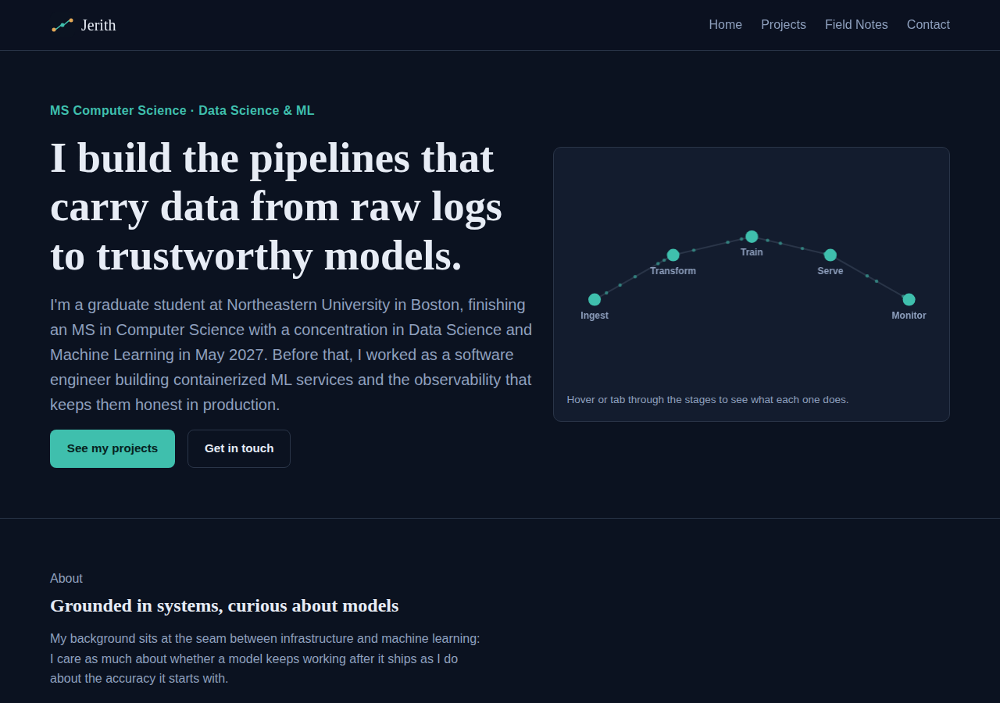
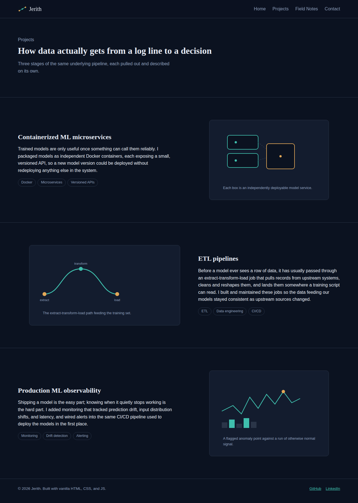

# Jerith — Personal Homepage

A front-end-only personal homepage built with vanilla HTML5, CSS3, and
ES6+ modules — no frameworks, no component libraries, no backend.

- **Author:** Jerith
- **Class:** _Add your course link here, e.g. `CS5610 Web Development — Section X`_
- **Live site:** _Add your GitHub Pages (or other) deployment URL here after deploying_

## Project objective

Build a static, multi-page homepage that introduces its owner, showcases
a few projects in depth, and includes one original interactive
component — while satisfying a strict technical bar: plain HTML/CSS/JS
only, ES6 modules, organized folders, accessible markup, linting, and
consistent formatting. See [`DESIGN.md`](./DESIGN.md) for the full
design document (project description, personas, user stories, and
mockups) behind these decisions.

## Screenshots

**Homepage hero**, with the interactive pipeline visualization:



**Projects page:**



## Pages

| Page             | URL               | Purpose                                             |
| ---------------- | ----------------- | ---------------------------------------------------- |
| Home              | `index.html`      | Hero, about, experience timeline, project preview, contact form |
| Projects          | `projects.html`   | Full write-ups of three projects                     |
| Field Notes (AI)  | `ai-notes.html`   | An AI-generated article, disclosed on the page itself |

## The original component

The hero includes `PipelineVisual`, a dependency-free `<canvas>`
component (`js/pipeline.js`) that draws the five stages of an ML
pipeline (ingest → transform → train → serve → monitor) as connected
nodes with particles animating along the path. Hovering or tabbing to a
node highlights it and writes a description into a caption element —
so it's an interactive explainer grounded in the actual subject matter
of the site, not a generic decorative effect. It respects
`prefers-reduced-motion` by freezing on a static frame.

## Folder structure

```
homepage-project/
├── index.html
├── projects.html
├── ai-notes.html
├── css/
│   └── styles.css
├── js/
│   ├── main.js          # nav, footer, contact form, bootstraps the visual
│   └── pipeline.js       # the original PipelineVisual canvas component
├── images/               # original SVG illustrations + favicon
├── docs/                 # README screenshots
├── DESIGN.md             # design document (personas, user stories, mockups)
├── package.json
├── eslint.config.js
├── .prettierrc.json
├── LICENSE               # MIT
└── README.md
```

## Building / running locally

This is a static site with no build step. Because the JS is loaded as
native ES6 modules (`<script type="module">`), browsers will block it
under the `file://` protocol via CORS — serve the folder over HTTP
instead:

```bash
# from the project root
python3 -m http.server 8000
# then open http://localhost:8000/index.html
```

Any static server works equally well (`npx serve`, VS Code's Live
Server, etc.).

### Linting and formatting

```bash
npm install
npm run lint      # ESLint over js/
npm run format     # Prettier, writes formatted files
npm run format:check
```

`eslint.config.js` is the flat config used for this project (ESLint 9+);
`.prettierrc.json` holds the Prettier rules the whole project follows.

## Deployment

Deployed as a static site via GitHub Pages:

1. Push this folder to a GitHub repository.
2. In the repo settings, enable **Pages** → deploy from the `main`
   branch, root folder.
3. GitHub serves `index.html` at `https://<username>.github.io/<repo>/`.

_Add the actual Pages URL above once deployed._

## Use of GenAI tools

Generative AI was used in two distinct ways on this project, both
disclosed here in full:

1. **Site-building assistance.** Claude (Anthropic) was used as a
   coding assistant to help draft the HTML structure, CSS design
   system, and the `PipelineVisual` JS component, based on prompts
   describing the assignment's requirements, the author's real
   background (MS CS at Northeastern, prior internship work on ML
   microservices/ETL/observability), and a request for an original,
   non-templated visual identity. All generated code was reviewed,
   tested locally, and adjusted (e.g., the pipeline canvas layout, the
   color palette, and copy) before inclusion.
2. **The `ai-notes.html` page content**, satisfying the assignment's
   requirement for a third, AI-generated page. The article text was
   generated by Claude (Anthropic, no specific dated model recorded)
   from the following prompt:

   > "Write a short field-notes-style article (roughly 500–700 words,
   > four subsections) for a computer science student's personal
   > website, on the topic of what machine learning observability
   > actually catches in production — covering input drift,
   > prediction drift, latency/error-rate monitoring, and alert
   > design. Tone: plain, specific, no marketing language, aimed at
   > other engineers."

   The output was reviewed for accuracy and lightly edited for length
   and consistency with the rest of the site, then published as-is
   with an on-page disclosure box crediting the model and describing
   this exact process (see the top of `ai-notes.html`).

## License

MIT — see [`LICENSE`](./LICENSE).
